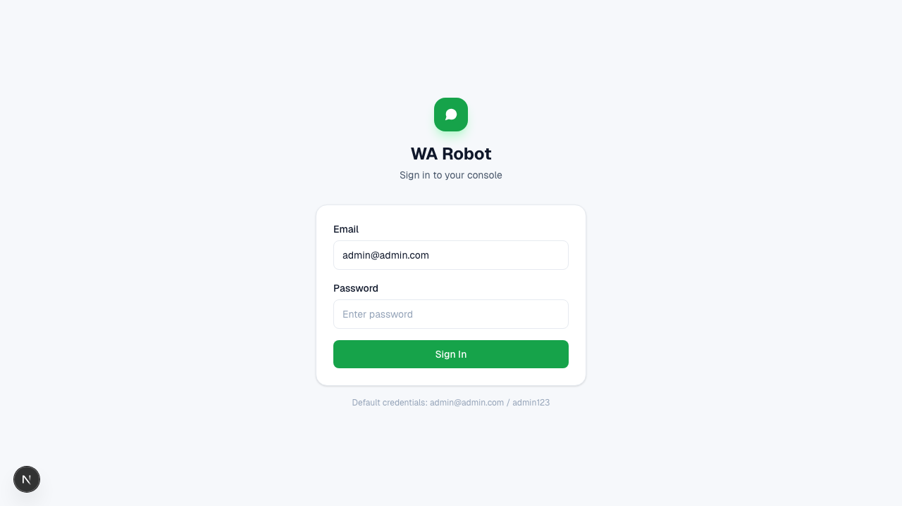

# Login and Access

## Default Credentials

- Email: `admin@admin.com`
- Password: `admin123`

## How to Login

1. Open `http://localhost:3000/login`.
2. Enter email and password.
3. Click **Sign In**.

After successful login, you will be redirected to `/dashboard`.

## Session Behavior

- Login creates an `auth_token` cookie.
- Session remains active for 7 days unless you sign out.
- Clicking **Sign Out** in the sidebar clears the session and returns to login.

## Screenshot

