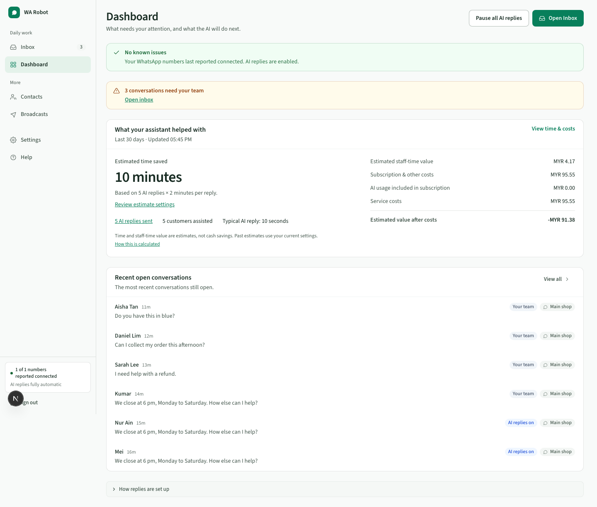

# Dashboard

Dashboard gives an owner a quick view of work needing help and the AI agents’
estimated value. Inbox is the default start page; choose Dashboard instead in Settings → Technical settings → Workspace preferences.

- **Needs your team:** the same full-record attention total used in Inbox, with a direct link.
- **Connection or setup issues:** named blockers and recovery links; connection status is the last gateway report.
- **What your AI agents helped with:** AI replies sent, customers assisted, typical reply time, estimated time saved and value after service costs.
- **Recent open conversations:** shortcuts to customer threads.
- **How replies are set up:** a collapsed supporting summary.

**Pause all AI replies** is an emergency control. It stops new automatic replies across
the workspace; manual replies and broadcasts continue. An already-started send can
still arrive. Resume in Settings → Automatic replies.

Use **View time & costs** to review the 7/30/90-day report and enter usual reply time,
hourly staff cost, subscription, other monthly costs, billing start and whether AI usage
is included. Estimates use current settings and remain incomplete when required costs
are unknown. Estimated staff-time value is capacity freed, not cash saved.

