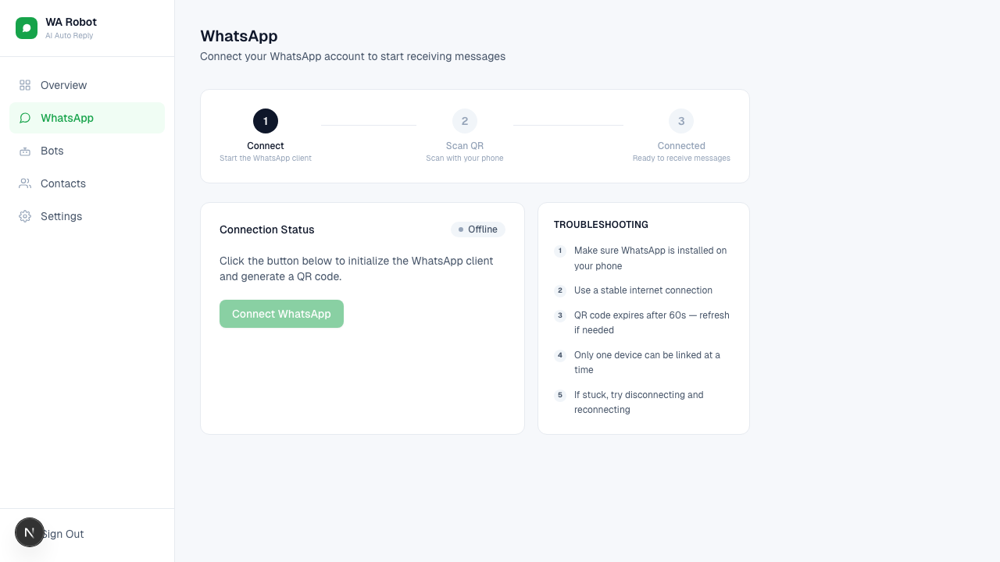

# WhatsApp Connection

Use the `WhatsApp` page to connect your WhatsApp account.

## Steps

1. Click **Connect WhatsApp**.
2. Wait for QR generation.
3. On your phone: WhatsApp -> Linked Devices -> Link a Device.
4. Scan the QR code.

## Status Flow

- `Offline`: not connected
- `Waiting for scan`: QR is ready
- `Connected`: session active

## Disconnect

- Click **Disconnect** if needed.
- Confirm the prompt.
- Auto replies stop until reconnect.

## Notes

- QR refreshes automatically.
- First launch can take longer.

## Screenshot

