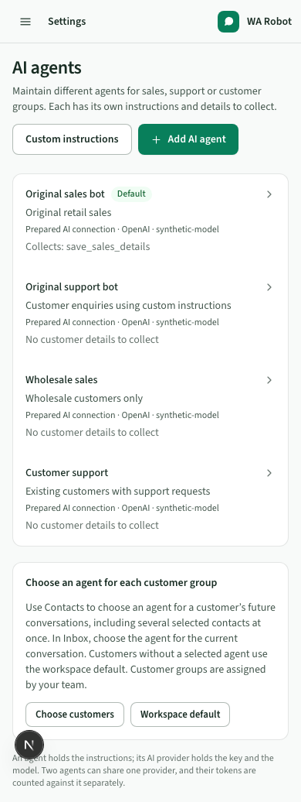

# AI agents (AI bots)

One business can maintain multiple AI agents for different customer groups. These are
the existing configurable AI bots, now called **AI agents** in the interface. For example,
use one for sales enquiries, one for customer support and another for wholesale customers.
Each has its own instructions, AI connection and allowed customer-detail collection tools.

## Create and maintain agents

1. Open **Settings → AI agents**. Agent management is in the business group. Use the content navigation above the page to move between Settings sections; AI agents stays selected while creating or editing one.
2. Choose **Add AI agent** for guided setup.
3. Give it a recognizable name and role/customer group. Add the business facts, prices,
   common answers, language and conditions for human help that apply to that group.
4. Choose the AI connection prepared for your business and save.
5. Try a question with that saved agent. Preview may incur AI charges, but sends no
   WhatsApp message and runs no customer-detail collection actions.

Repeat for each agent your business needs. Click a guided agent to update its own details;
its save preserves other agents, collection tools, enabled state and workspace default.

## Keep custom instructions and collection settings

**Custom instructions** opens the original add editor at `/bots/new`. Existing custom
agents open their original edit screen at `/bots/[id]`; their IDs, prompts and tools are
retained. This editor sets instructions, AI connection, allowed collection tools and
whether the agent is enabled or used as the workspace default.

**Guided agent details & preview** lets you review guided setup for an existing agent.
Replacing a custom prompt requires explicit confirmation, including a custom edit made
after earlier guided setup. Cancel preserves its saved instructions. Unsupported external
runtime agent types use the original editor and are not converted by guided setup.

## Choose the customers each agent helps

- **Contacts:** choose a default agent for a customer’s future conversations. Select several
  contacts to assign the same agent to a customer group.
- **Inbox:** choose **Agent for this conversation** under Customer details to change the active
  thread independently. When AI is allowed, eligible waiting input is scheduled for the newly
  selected agent; obsolete generation is suppressed.
- **Automatic replies:** choose the workspace default for customers without a selection.

Customer groups are assigned by your team. Naming a role does not automatically classify
customers or enforce access permissions. Taking over pauses AI for the active conversation
without changing its customer’s future agent.

## AI connections and deletion

Technical support can add accounts, keys and models in Settings → Technical settings →
AI connections. Technical settings has its own side navigation inside the content area. Several agents may share one connection while keeping different instructions
and collection tools. Deleting a connection is blocked while agents still use it.

Delete an agent from its custom editor. Existing messages remain; conversations may fall
back to the workspace default. Its guided profile is removed with it.

