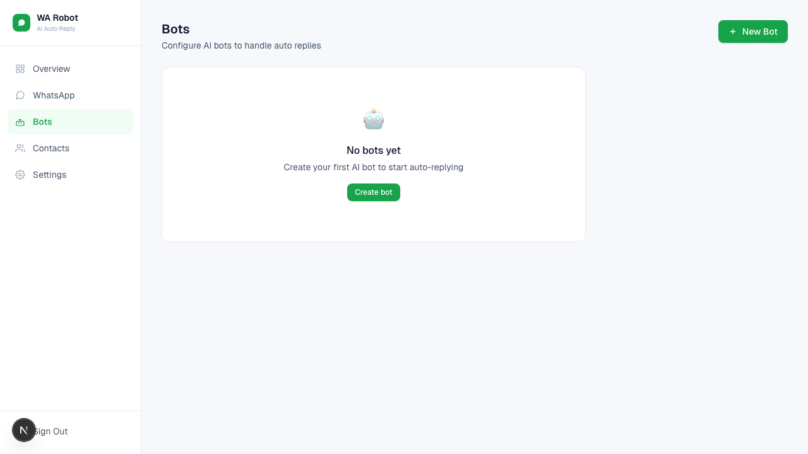

# Bots Management

Bots define how AI replies are generated. A bot holds the instructions; the
**AI provider** it points at holds the vendor, the API key and the model.

## Add an AI Provider (do this first)

1. Go to `AI providers`.
2. Click **Add provider**.
3. Fill in:
- Provider name (your own label)
- Vendor (`OpenAI` or `Google Gemini`)
- API Key — optional if the server already has one
4. Click **Load available models** and choose one. The list comes from the
   vendor, so it only offers models that key can actually use.
5. Click **Add provider**.

Several bots can share one provider. Its page shows how many tokens each bot has
spent through it.

## Create a Bot

1. Go to `AI bots`.
2. Click **Create bot**.
3. Fill in:
- Bot Name
- System Prompt
- AI provider — the account this bot answers through
4. Optional: attach tools, and enable **Use as the default bot**.
5. Click **Create bot**.

## Edit or Delete

- Click any bot from the list to edit.
- Update fields and save.
- Use **Delete bot** to remove it.

Deleting an AI provider is refused while a bot still points at it. Move those
bots to another provider first — the message names them.

## Prompt Tips

- Keep instructions specific to your business tone.
- Add fallback behavior for unknown questions.
- Keep responses concise for WhatsApp readability.

## Screenshot

