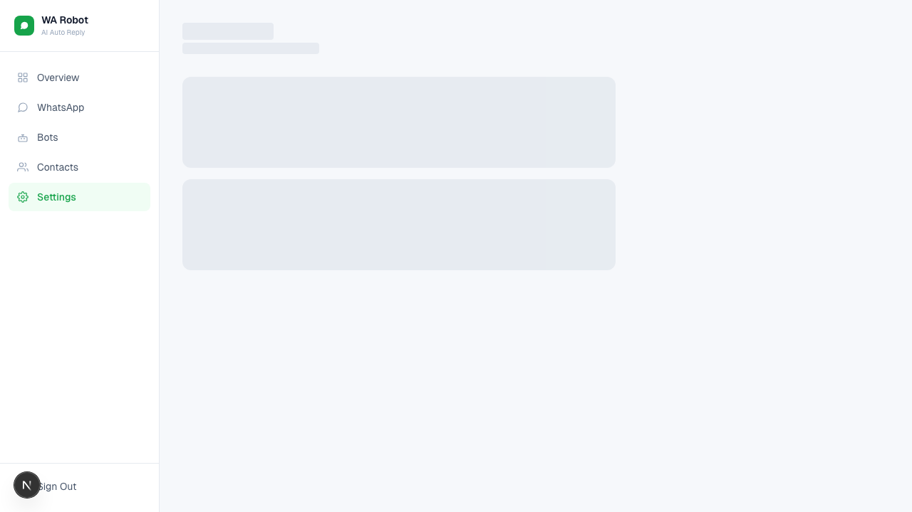

# Reply Settings

**Automation → Reply settings** controls system-wide reply behaviour. It used to
live under `Settings`; `Settings` is now a hub that points at whichever page owns
each setting.

Changes here are a draft until you choose **Save changes** — the "Currently
saved" strip at the top always describes what the server has, not what you have
just switched.

## AI replies (global switch)

- When ON: the system can send AI replies.
- When OFF: no AI replies are sent, whatever any conversation or contact says.

Incoming messages are stored either way — turning this off stops replies, not
receiving. New contacts inherit this switch as their starting AI setting.

## Default Bot

Bot selection walks from most specific to least:

```
conversation bot  →  contact bot  →  default bot (here)  →  bot flagged Default
```

Disabled bots are skipped at every step.

Recommended: always set a default bot.

## Save and Discard

- Changes show an unsaved banner.
- Click **Save Settings** to apply.
- Click **Discard** to revert.

## Related

- Per-conversation control lives in the [Inbox](./10-inbox.md).
- Per-contact defaults live in [Contacts](./06-contacts-management.md).

## Screenshot


