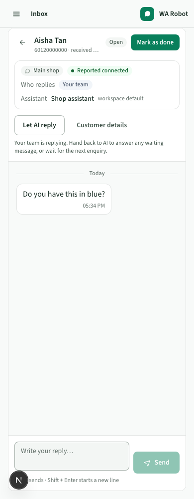

# Inbox

Inbox is the main daily screen for enquiries handled by AI or your team.

## Find work

Use **Needs attention**, **All open** or **Done**, then search by customer name or phone.
Filter by AI or Your team when needed. Counts cover all records; pages show 25 matching
conversations. Attention reasons identify failed replies, unanswered team work, paused
AI or connection/assistant blockers. Emoji-only decoration is excluded.

## Take over and reply

**Take over** pauses AI for this conversation and focuses the reply box. Type and
press Enter to send, or Shift+Enter for a new line. In an AI conversation,
**Take over and send** claims it for your team before delivery. Failed sends remain
visible and keep team ownership. A stale change from another operator asks you to refresh.

Taking over does not change the customer's preference for future conversations.
A send or external action already in progress can still finish; the takeover notice
warns when an AI send is already processing.

**Let AI reply** hands this open conversation back and schedules one response to eligible
waiting customer messages. It does not resend old replies or reply to decoration.
Global pause still applies. Choose an AI agent in the conversation-details drawer. Different conversations can use different configured agents. A switch suppresses the old generation and schedules eligible waiting input for the new agent when AI is allowed.

## Understand status

Customer, AI and Your team labels identify who sent each message. AI replies on means
AI is allowed to respond, not that it is currently writing. Open / Done describes the
conversation lifecycle separately. Failed messages show their error. Sent means the
WhatsApp gateway accepted the message; delivery and reading are not confirmed.

**Mark done** closes the thread. A later customer message starts a new conversation
using the customer's future AI preference and selected agent. Maintain multiple agents in Settings → AI agents. Set a customer’s future agent in Contacts or the
conversation-details drawer. Transcript history retains the existing 200-message cap;
Activity provides paginated investigation history.

Drafts remain when switching conversations within Inbox, and incoming updates do not
pull you away from older messages you are reading. On a phone, open one thread at a time;
takeover remains visible above the messages.

