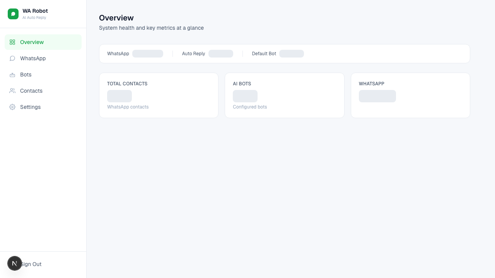
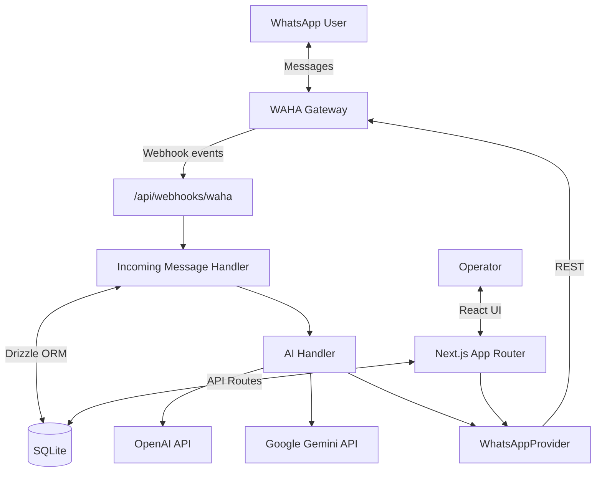
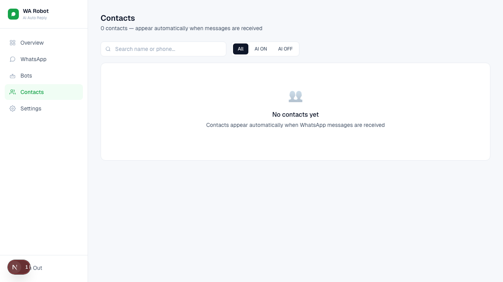
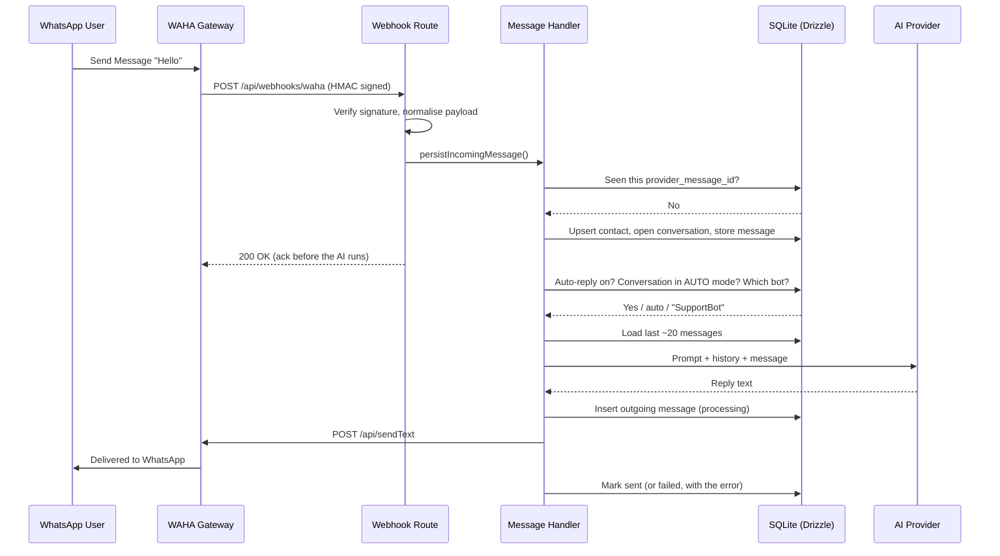

# System Design: WhatsApp AI Automation Handler

## 1. Executive Summary
The **WhatsApp AI Automation Handler** is a full-stack automation platform that integrates WhatsApp messaging with advanced LLM capabilities (OpenAI and Google Gemini). Built as a unified **Next.js** application, it provides businesses with a seamless dashboard to manage automated customer interactions, configure AI personalities, and monitor real-time message flows.



---

## 2. System Architecture
WhatsApp connectivity is delegated to **WAHA** (WhatsApp HTTP API), running as a
separate container. WA Chat Flow is a pure business-logic application that talks
to WAHA over REST and receives events by webhook. It no longer embeds a browser
automation stack, which is what made the previous design fragile to restart.

### 2.1 High-Level Overview


### 2.2 Component Breakdown
- **Full-Stack Core (Next.js 16):** Unified React frontend (App Router) plus backend API routes.
- **WhatsApp Provider (`lib/wa/`):** A `WhatsAppProvider` interface with a single implementation, `WahaProvider`. It is the only module aware of WAHA's REST surface; business logic never imports it directly.
- **Webhook Receiver (`app/api/webhooks/waha/`):** Verifies an HMAC signature, normalises the payload and hands off. It contains no AI logic and acknowledges before the reply is generated.
- **Message Handler (`lib/messaging/incoming-handler.ts`):** The single entry point for inbound messages from any transport — deduplicate, resolve contact and conversation, store, then decide whether the AI answers.
- **Conversation Layer (`lib/conversation/`):** Threads that group messages, carry AUTO/HUMAN mode and OPEN/RESOLVED status, and back the Inbox.
- **AI Handler (`lib/ai/`):** An `AIHandler` interface. `DirectAIHandler` calls OpenAI or Gemini with the bot prompt plus recent history, and owns the tool loop; an `AgentRuntimeHandler` will slot in behind the same interface.
- **Tools (`lib/tools/`):** Capabilities the AI can invoke mid-conversation. `registry.ts` turns configured rows into the function schemas a model sees, `runner.ts` executes one call, and a `CaptureSink` writes the result out. Business logic never imports a sink directly.
- **Persistent Data Layer:** **Better-SQLite3** in WAL mode with **Drizzle ORM** and versioned SQL migrations.
- **Middleware Security:** Cookie-session auth for the dashboard and API; the webhook route is exempt and authenticated by HMAC instead.

### 2.3 Deduplication
Webhook delivery is at-least-once — WAHA retries on non-2xx and a restart can
replay events. Every inbound message carries a provider message id, which is
stored under a unique index on `(provider, provider_message_id)`. The handler
checks it before inserting and treats a unique-constraint violation as a
duplicate, which also covers two concurrent deliveries of the same event.

---

## 3. Core Features & Functionality

### 3.1 AI Bot Orchestration
- **Dynamic Personalities:** Define multiple bots with unique system prompts, instructions, and target AI providers.
- **Unified Provider Interface:** Seamlessly switch between OpenAI and Gemini without changing business logic.
- **Parameter Control:** Customize AI behavior per bot (Enabled/Disabled status, specific API keys).


### 3.2 Intelligent Message Routing
Each incoming message runs through:
1. **Deduplication:** Ignore an event already stored under the same provider message id.
2. **System Filter:** Global auto-reply master switch.
3. **Conversation Mode:** `auto` lets the AI answer; `human` leaves the thread to an operator.
4. **Bot Selection:** Conversation bot → contact bot → system default → the bot flagged default. Disabled bots are skipped.
5. **Context:** The bot prompt plus the last ~20 text messages of that conversation.
6. **Tools:** Whatever the selected bot has been assigned, capped at 3 call rounds per reply.

### 3.6 Tools
A bot can be given tools it may call mid-conversation. The only kind today is
`sheet_capture`: the model collects a configured set of fields and they are
appended to a Google Sheet.

Sales and support capture are two rows in `tools`, not two code paths — the
field list drives the JSON Schema the model sees, the server-side validation and
the sheet column order at once, so adding a field is a dashboard edit.

The loop lives in `DirectAIHandler`: ask the model, run what it asked for, feed
the results back, ask again. A validation failure is returned to the model as a
normal result rather than thrown, which is what turns it into natural
slot-filling — the model reads "missing Email" and asks the customer for it.
On the final round tools are withdrawn, so a model stuck on a failing tool
cannot loop.

A public sheet link is not writable — the Sheets API needs OAuth or a service
account — so writes go through an Apps Script Web App deployed on the sheet
itself, behind a `CaptureSink` interface. Every capture is written to
`tool_invocations` *before* the sink is called, so a Google outage costs the
sync and not the lead; failed rows are retryable from the dashboard.

### 3.4 Human Inbox
Conversations are the operational unit. The Inbox lists them by Open / Resolved
with search, and each thread exposes the `AI Auto Reply` toggle, bot selection,
a Resolve action and a manual reply box. Manual replies are stored with
`sender_type = human`, AI replies with `sender_type = ai`, so the transcript
shows exactly who said what.

### 3.5 Delivery Status
Outbound messages are written before the send with status `processing`, then
moved to `sent` (with the provider message id) or `failed` (with the error).
A failure therefore stays visible in the thread instead of disappearing, and no
queue system is required.



### 3.3 WhatsApp Session Lifecycle
- **QR Code Authentication:** WAHA renders the pairing code; the dashboard fetches and displays it.
- **State Persistence:** Sessions live in WAHA's own storage, so they survive app restarts and redeploys.
- **Live Monitoring:** Status is read from the gateway on demand and pushed by `session.status` webhooks.


---

## 4. Technical Stack
| Category | Technology |
| :--- | :--- |
| **Framework** | Next.js 16 (App Router) |
| **Language** | TypeScript |
| **Styling** | TailwindCSS 4 |
| **Database** | Better-SQLite3 |
| **ORM** | Drizzle ORM |
| **WA Integration**| WAHA (WhatsApp HTTP API) |
| **Deployment** | Docker Compose (app + WAHA) |
| **AI Providers** | OpenAI API, Google Generative AI |

---

## 5. Sequence Diagram: Message Processing Flow
The following diagram illustrates how the system handles a "headless" message event within the Next.js runtime.



---

## 6. Key Implementation Highlights
- **Replaceable Transport:** `WhatsAppProvider` and `AIHandler` are the two seams. WAHA and the future Agent Runtime can each be swapped without touching conversation or inbox logic.
- **Fast Webhook Acknowledgement:** Persistence is synchronous (so a retry cannot duplicate a message) while the AI call runs after the response is sent (so a slow model cannot cause a redelivery).
- **Versioned Migrations:** Drizzle SQL migrations replace the old startup `CREATE TABLE` / `ALTER TABLE` chain. A pre-migration database is detected, reshaped in place and stamped, so existing installs upgrade without data loss.
- **SQLite Hardening:** WAL journaling, a 5s busy timeout, enforced foreign keys, and indexes on the conversation/message access paths.
- **Secrets from the Environment:** No default credentials. `JWT_SECRET` is required in production, the admin account is bootstrapped from env, and stored bot API keys are never returned to the browser.

---

## 7. Deployment
Two independent Compose projects on one host, joined by a shared Docker network:

```
Small VPS

waha/docker-compose.yml              docker-compose.yml
│                                    │
└── waha                             └── wa-chat-flow   (behind a TLS proxy)
    ├── 127.0.0.1:3001 only              ├── Next.js
    └── waha/data/{sessions,media}       └── /storage/app/app.db
                └────── shared docker network ──────┘
```

Keeping them separate means the gateway can be restarted, upgraded or moved to
another host without redeploying the application. The only shared secret is
`WAHA_API_KEY`; the coupling is otherwise just two URLs (`WAHA_BASE_URL`
outbound, `WAHA_WEBHOOK_URL` inbound).

WAHA's API can send messages from the connected number, so it is never exposed
publicly — WA Chat Flow is the only public-facing service. Note that WAHA has
**two independent auth systems**: browser basic auth for its dashboard, and the
`X-Api-Key` header for its REST API. Dashboard access grants no API access.

Both volumes are backed up daily (`pnpm backup`, 7 days retained): the SQLite
database via SQLite's online backup API, and WAHA's session storage as a
tarball (`WAHA_STORAGE_DIR`).

---

## 8. Future Roadmap
- **Agent Runtime Handler:** A second `AIHandler` (`handler_type = external_agent`) delegating to an agent service that owns RAG, knowledge base and MCP.
- **Service-account sink:** A second `CaptureSink` calling the Sheets API directly, for deployments that would rather manage a GCP service account than an Apps Script deployment.
- **Media Handling:** Storing and displaying images, audio and documents rather than recording their type only.
- **Outbound Sync:** Capturing messages the operator sends from the phone itself (`fromMe` events).
- **History Summarization:** Summarising long threads instead of truncating to the last 20 messages.
